## Practica 1
### Presentación de las herramientas - por Paula Ruiz

### Instalación y configuración.
Empezamos creando las dos máquinas virtuales con Ubuntu Server 16.04, a las cuales les instalamos OpenSSH server y LAMP server desde el principio dentro de la inicialización del programa.

A continuación, configuramos las redes dentro de la configuración de VirtualBox para que ambos servidores tengan la conexión entre ellos y la máquina principal que está en Windows.

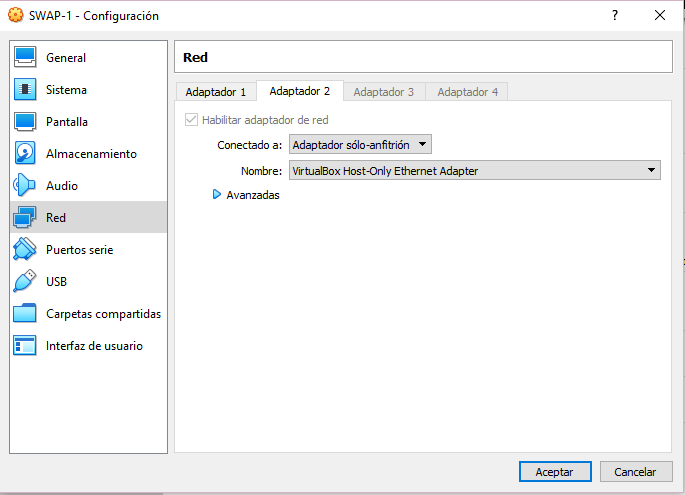

Además, preparamos los servidores para que puedan tener comunicación entre ellos y el host. Para ello les añadimos los IPs correspondientes mediante la interfaz de sincronización enp0s8 (ya que por defecto no están definidos) todo esto en el archivo /var/network/interfaces, 192.168.56.100 (Máquina 1) y 192.168.56.200 (Máquina 2).

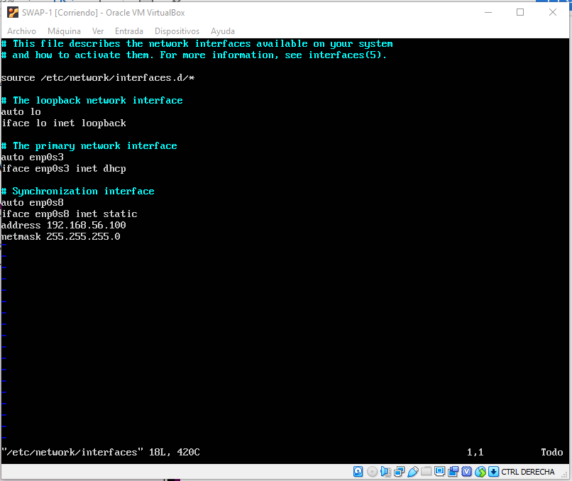
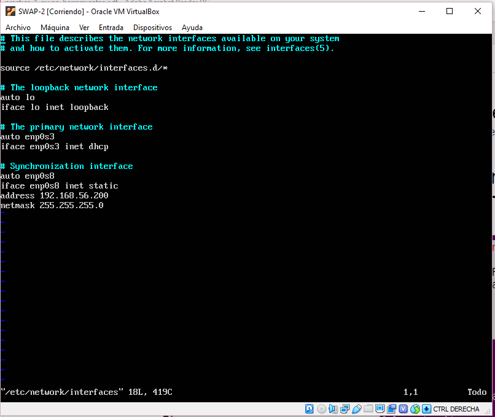

Activamos el __enp0s8__ mediante el comando `ifup enp0s8`. Y la configuración de ambas máquinas quedaría tal que así:

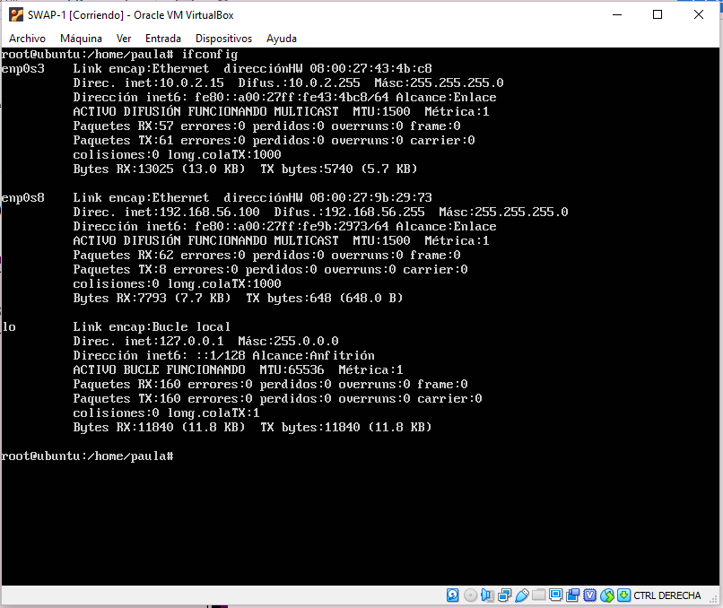

Probamos haciendo ping entre ambas máquinas tienen conexión entre ellas:

`ping 192.168.56.100`

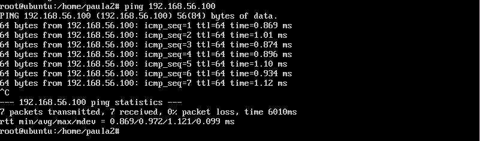

`ping 192.168.56.200`

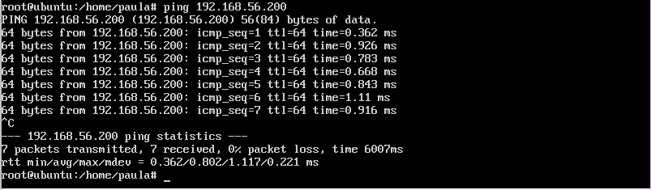

_A partir de aquí solo mostrare las capturas de pantalla de una única máquina, ya que hago paralelamente lo mismo en ambas._

### Funcionamiento LAMP
Para comprobar el funcionamiento de LAMP probamos que cual es la versión que usamos de apache y si esta funcionando.

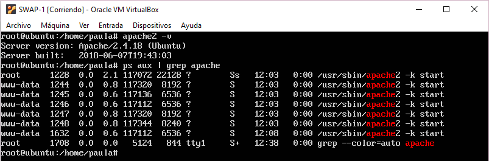

También comprobamos la versión de php y si está en funcionamiento.

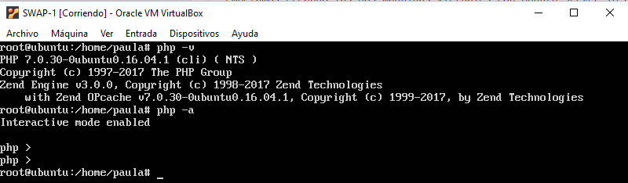

Y por último, probamos si podemos meternos en MySQL como base de datos del servidor.

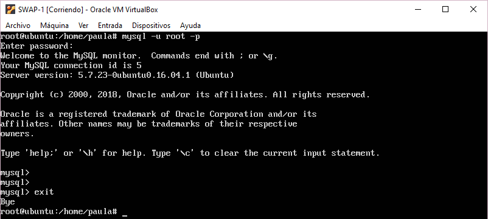

### Funcionamiento SSH
Para comprobar el funcionamiento de ssh hemos usado la orden `shh ipmaquina -l usuario` entre ambas máquinas.

Prueba de la 1 a la 2:

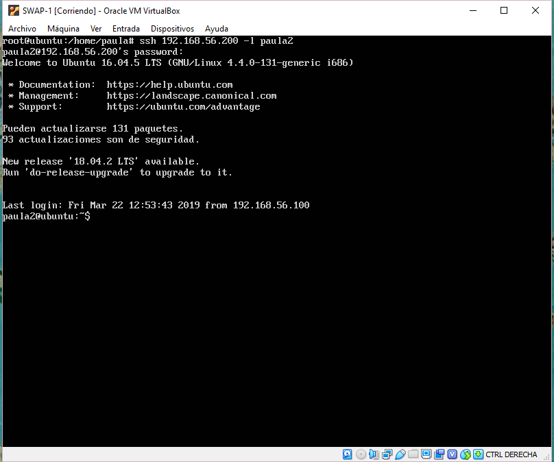

Prueba de la 2 a la 1:

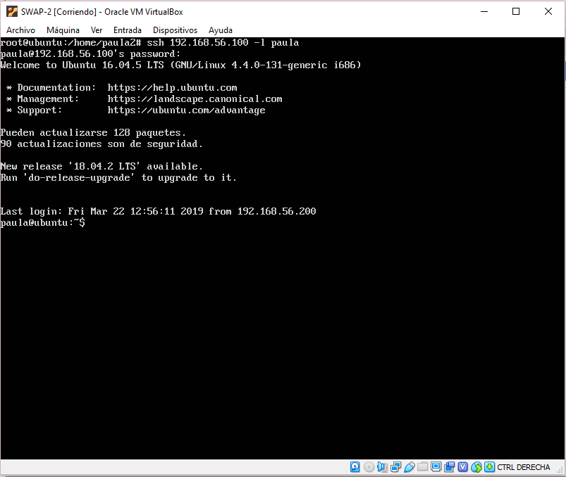

### Funcionamiento cURL
Para la comprobación de cUrl creamos un documento HTML.

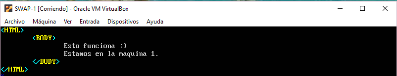

Y comprobamos mediante cUrl que tenemos acceso al mismo mediante la máquina 2 a la máquina 1.

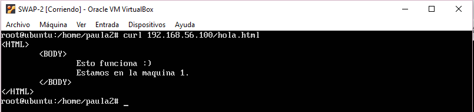

Y comprobamos mediante cUrl que tenemos acceso al mismo mediante la máquina 1 a la máquina 2.

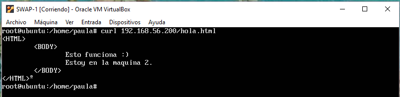

Y también comprobamos desde el nuestro navegador (HOST) que podemos acceder al mismo archivo.

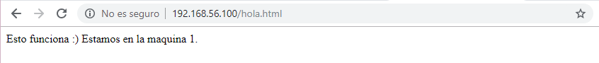
