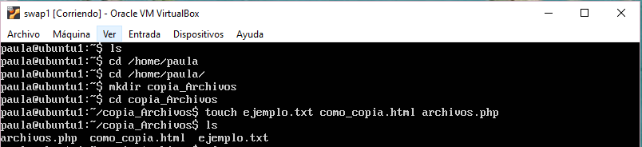
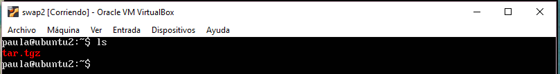
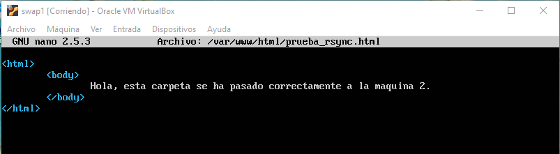
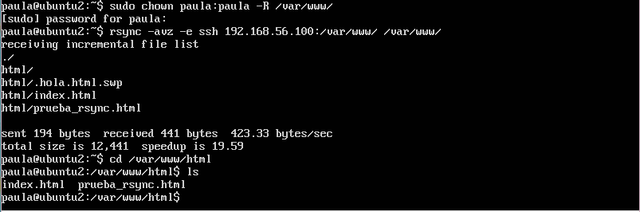
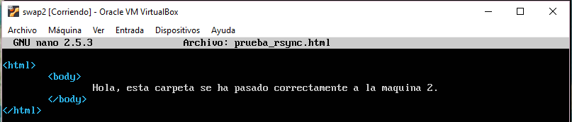

## Practica 2
### Clonar la informacion de un sitio web - por Paula Ruiz

### Funcionamiento de la copia de archivos por ssh.
Esta funcion sirve para crear un archivo tar.tgz de un equipo y dejarlo directamente en el equipo destino si no disponemos espacio en nuestro disco local.

En esta ocasion vamos a crear una carpeta en nuestra maquina 1, con diferentes tipos de archivos.

Y ahora vamos a aplicar a la carpeta creada la compresion al archivo tar.tgz en nuestra maquina 2.

`tar czf - copia_Archivos | ssh 192.168.56.200 'cat > ~/tar.tgz'`

Y ahora comprobamos que el archivo comprimido se encuentra en nuestra maquina 2.

### Clonado de una carpeta entre dos maquinas (con rsync).

_A partir de aqui todo lo que ejecutemos sera en la maquina 2._

Para ello lo primero que necesitamos es instalar rsync mediante `sudo apt-get install rsync`

Para probar que funciona vamos a sincronizar las carpetas `/var/www/` de ambas maquinas. Primero crearemos un documento __prueba_rsync.html__ en la maquina 1 para saber si se ejecuta con exito nuestra sincronizacion.

Luego sincronizaremos nuestras maquinas mediante la ejecucion:

`rsync -avz -e ssh 192.168.56.100:/var/www/ /var/www/`

Nos pide la clave de usuario, y tras unos momentos podemos comprobar que el directorio ha sido clonado con exito. Para ello revisamos que en la maquina 2 se encuentre el fichero que creamos anteriormente en la maquina 1.

