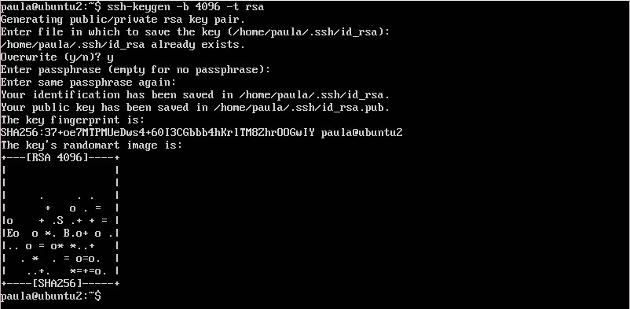
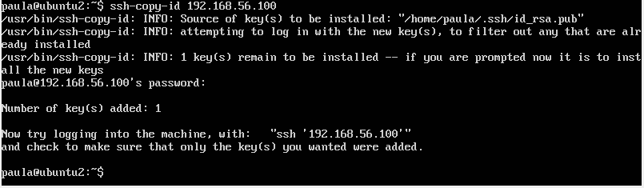
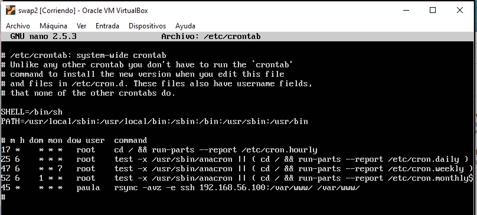
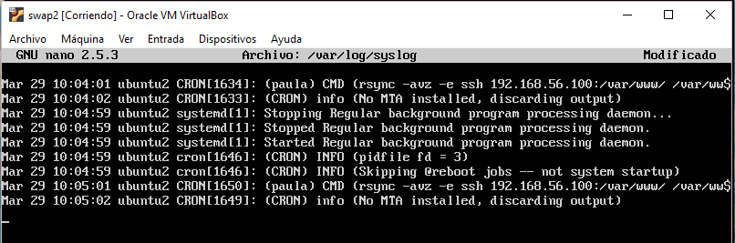
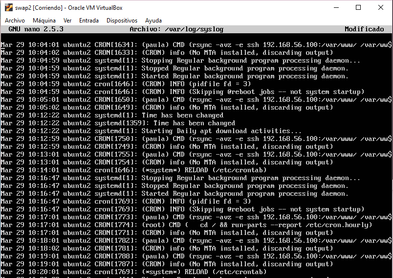

## Practica 2
### Clonar la información de un sitio web - por Paula Ruiz

### Funcionamiento de la copia de archivos por ssh.
Esta función sirve para crear un archivo tar.tgz de un equipo y dejarlo directamente en el equipo destino si no disponemos espacio en nuestro disco local.

En esta ocasión vamos a crear una carpeta en nuestra máquina 1, con diferentes tipos de archivos.

Y ahora vamos a aplicar a la carpeta creada la compresión al archivo tar.tgz en nuestra máquina 2.

`tar czf - copia_Archivos | ssh 192.168.56.200 'cat > ~/tar.tgz'`

Y ahora comprobamos que el archivo comprimido se encuentra en nuestra máquina 2.

### Clonado de una carpeta entre dos máquinas (con rsync).

_A partir de aquí todo lo que ejecutemos será en la máquina 2._

Para ello lo primero que necesitamos es instalar rsync mediante `sudo apt-get install rsync`

Para probar que funciona vamos a sincronizar las carpetas `/var/www/` de ambas máquinas. Primero crearemos un documento __prueba_rsync.html__ en la máquina 1 para saber si se ejecuta con éxito nuestra sincronización.

Luego sincronizaremos nuestras máquinas mediante la ejecución:

`rsync -avz -e ssh 192.168.56.100:/var/www/ /var/www/`

Nos pide la clave de usuario, y tras unos momentos podemos comprobar que el directorio ha sido clonado con éxito. Para ello revisamos que en la máquina 2 se encuentre el fichero que creamos anteriormente en la máquina 1.

### Configuración de ssh para acceder sin que solicite contraseña.

Ahora buscamos acceder a la máquina 1 desde la máquina 2 a través del servicio ssh sin que pidan contraseñas. Para ello vamos a usar una autentificación con un par de claves públicas y privadas, que podemos obtener mediante la función `ssh-keygen` de la siguiente manera:

`ssh-keygen -b 1096 -t rsa`

Dejamos en blanco el hueco que nos pide un lugar donde guardar la clave _Enter file in which to save the key:_ para que se cree por defecto en el directorio __~/.ssh__. Además, para el caso de querer conectar equipos sin necesidad de contraseña, también tenemos que dejar en blanco el hueco de _passphrase_.

Para copiar la clave de la máquina 2 a la máquina 1 usamos el comando `ssh-copy-id` a continuación de la id de la máquina destino.

`ssh-copy-id 192.168.56.100`

Ahora nuestra clave se encuentra en el archivo __~/.ssh/authorized_keys__ de la máquina 1. Si por casualidad se perdiera la clave, volvería pedirnos la contraseña.

Podemos comprobar que ahora haciendo `ssh`, desde nuestra máquina 1 a nuestra máquina 2, no se nos pide ninguna contraseña.

### Establecer una tarea en cron que se ejecute cada hora.

Por último, vamos a usar `crontab` para administrar la sincronización de nuestras máquinas en segundo plano.

Para ello, lo primero que vamos a hacer es editar el archivo __/etc/crontab__ y añadirle la siguiente tarea:

`m *  * * *  paula  rsync -avz -e ssh 192.168.56.100:/var/www/ /var/www/`

_pongo m en los minutos porque para empezar he puesto un * para que se ejecutase cada minuto para ver si funcionaba, y luego lo he cambiado para que ejecute cada hora a los 45, en la captura de pantalla sale que lo ejecuta cada hora._

A continuación, ejecutamos `sudo service cron restart` para reiniciar el cron y que capte la nueva tarea que hemos añadido. Finalmente, para ver que nuestra tarea funciona no desplazamos hasta el archivo __/var/log/syslog/__ donde podemos comprobar que no existe ningún error y que nuestra tarea se ejecuta perfectamente cada hora.

