## Practica 4.
### Asegurar una granja web - por Paula Ruiz.

### Crear e instalar un certificado SSL autofirmado.
##### Primero instalamos en la Maquina 1

Lo primero que vamos a hacer en esta practica es instalar un certificado SSL para brindar mas seguridad al visitante de una pagina web. El protocolo SSL es un protocolo que se ubica en la pila de protocolos sobre TCP/IP, por lo que proporciona servicios de comunicacion segura entre cliente y servidor.

Asi que empezamos activando el module SSL de Apache con el comando `a2enmod ssl`.

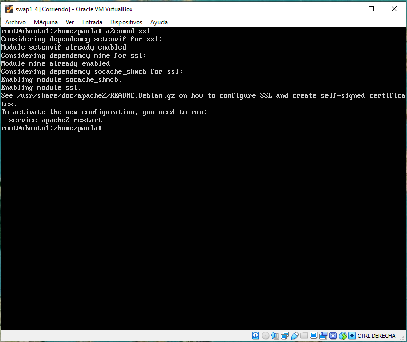

Y a continuacion activamos el servicio de apache y creamos el directorio donde vamos a crear las claves, y las creamos mediante OpenSSL.

`service apache2 restart
mkdir /etc/apache2/ssl
openssl req -x509 -nodes -days 365 -newkey rsa:2048 -keyout /etc/apache2/ssl/apache.key -out /etc/apache2/ssl/apache.crt`

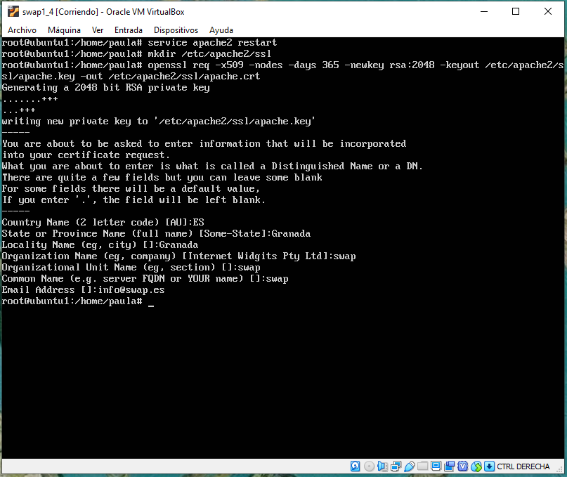

A continuacion editamos el archivo _/etc/apache2/sites-available/default-ssl.conf_ añadiendo las siguientes lineas:

`SSLCertificateFile /etc/apache2/ssl/apache.crt
SSLCertificateKeyFile /etc/apache2/ssl/apache.key`

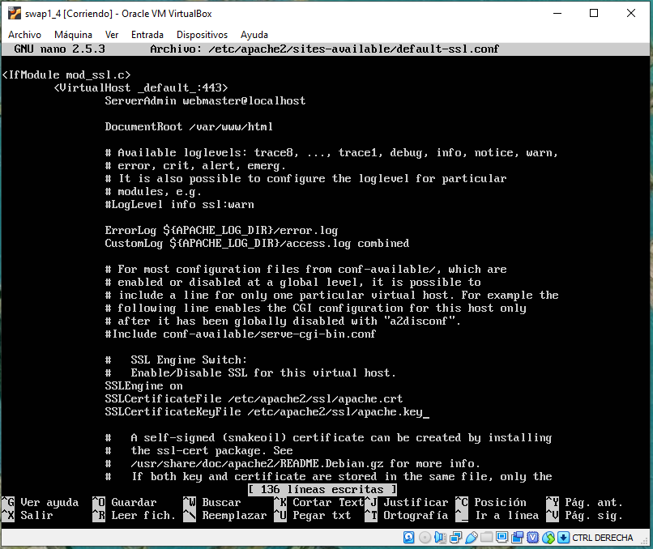

Por ultimo activamos el sitio default-ssl y reiniciamos Apache.

`a2ensite default-ssl
service apache2 reload`

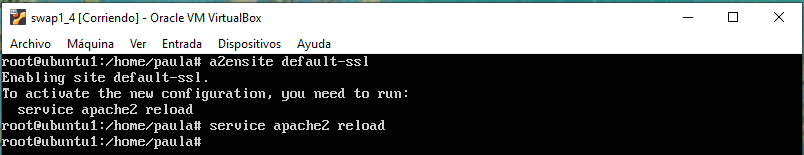

Y por ultimo comprobamos que esto funciona:

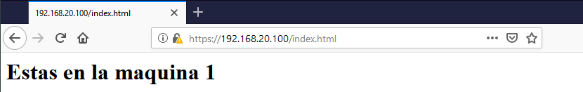

##### Y despues lo copiamos a la Maquina 2 y al balanceador mediante Rsync

Ahora vamos a copiar las claves del certificado al balanceador y a la maquina 2 mediante el comando:

`rsync -avz -e ssh 192.168.20.100:/etc/apache2/ssl/ /home/paula/ssl/`

Primero lo pasamos al home de cada maquina, y a continuacion en la maquina 2 lo movemos a su propia carpeta en _/etc/apache2/ssl_, mientras que en el balanceador podemos dejarlo en el mismo home.

A continuacion una breve trayectoria de las configuraciones en ambos servidores.

__En el balanceador:__

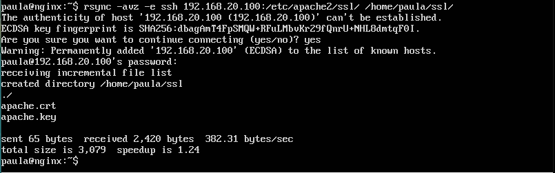

Una vez tenemos la copia de las claves para el certificado, nos dirigimos al directorio _/etc/nginx/conf.d/default.conf_ y lo modificamos para que pueda escuchar tambien el _https_ desde el puerto _443_.

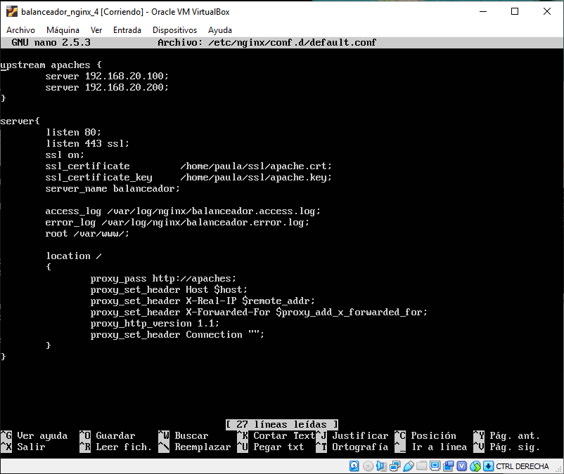

Y comprobamos que todo funciona mediante la orden:

`curl -k https://192.168.20.105/index.html`

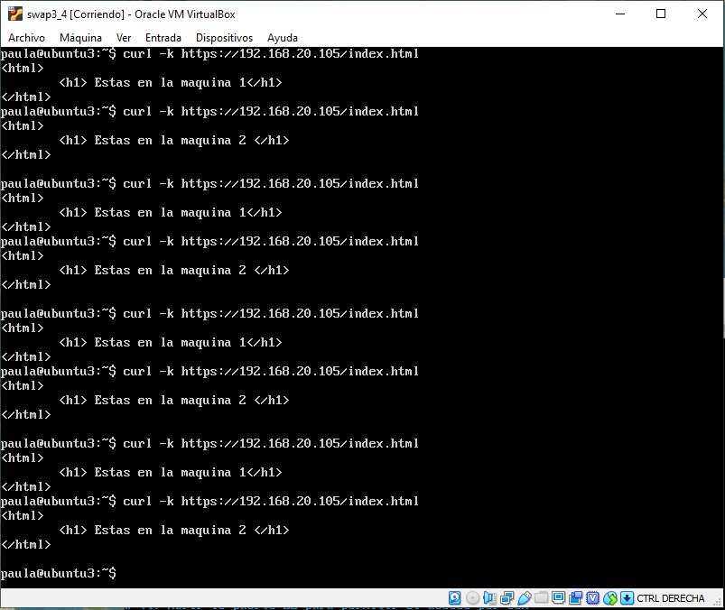

__En la maquina 2:__

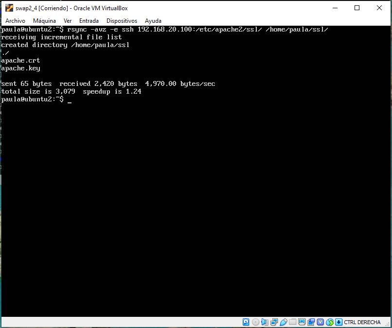

Una vez que lo tenemos aqui, hacemos los mismos pasos que hemos hecho antes para la maquina 1, excepto lo de crear el certificado.

Activamos el sitio y reiniciamos apache

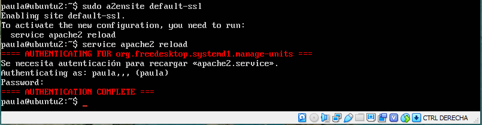

Y por ultimo comprobamos que todo funciona:

###Configurar cortafuego con IPTABLES.

Para configurar el cortafuegos, lo primero que creamos es un script con la configuracion basica para un cortafuegos en Ubuntu, lo llamare _script_iptables.sh_ y lo ubicare en la carpeta _/usr/local/bin/_.

A continuacion, vamos a hacer que se ejecute cada vez que se inicie la maquina. Para ello crearemos un demonio y lo ubicaremos en la carpeta _/etc/systemd/system/_ y lo llamaremos _config-iptables.service_.

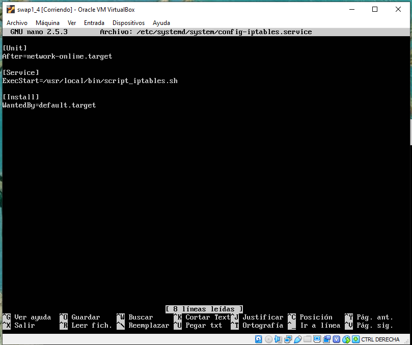

Una vez creado, mediante los siguientes comandos, lo activamos.

`systemctl daemon-reload
systemctl enable config-iptables.service`

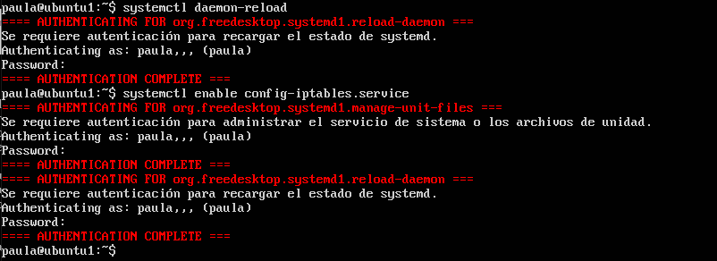

Y ya por ultimo mediante `netstat -tulpn` y `iptables -L -n -v` comprobamos que todo funciona bien.

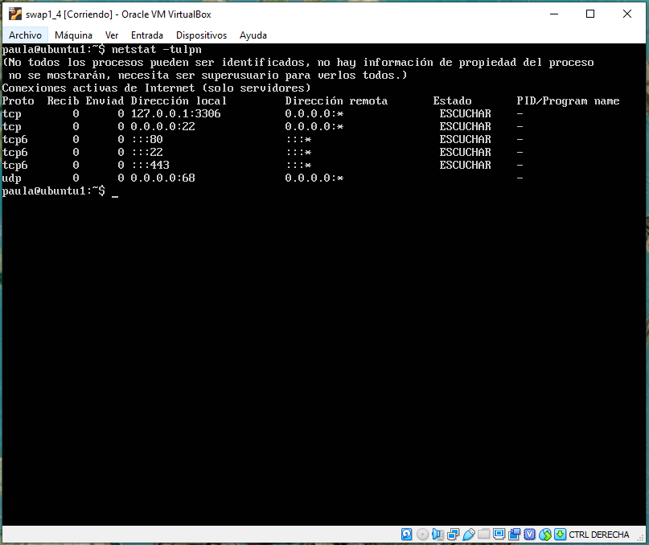

