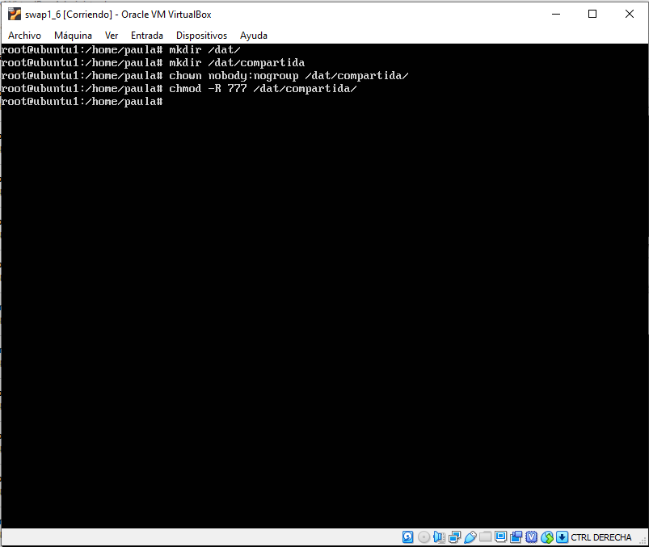
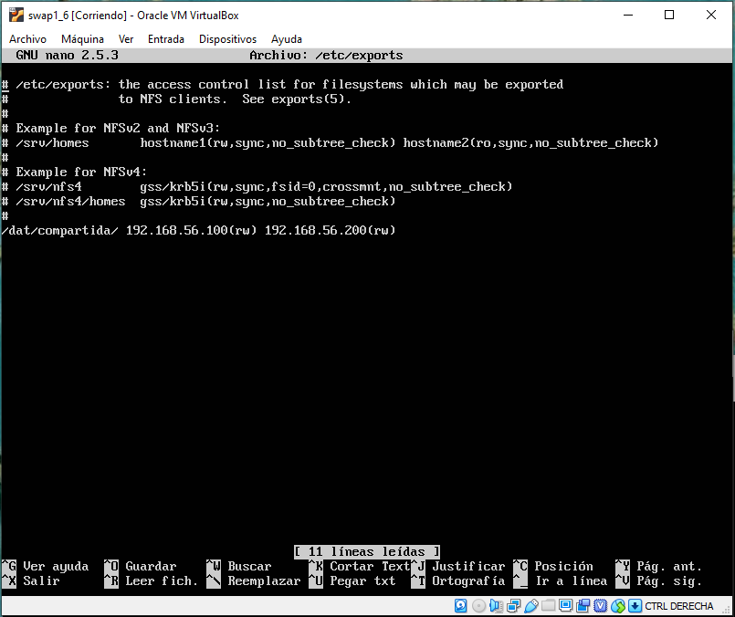
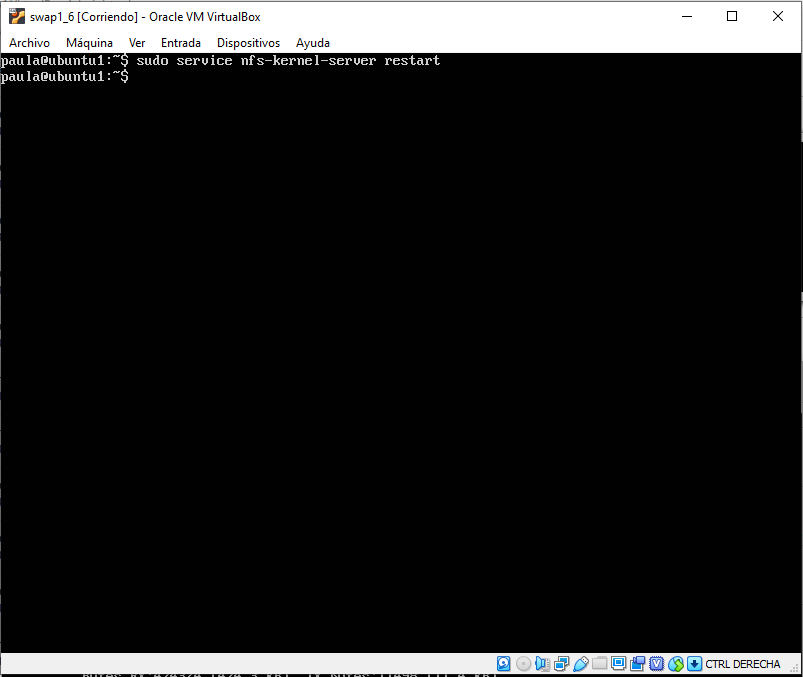
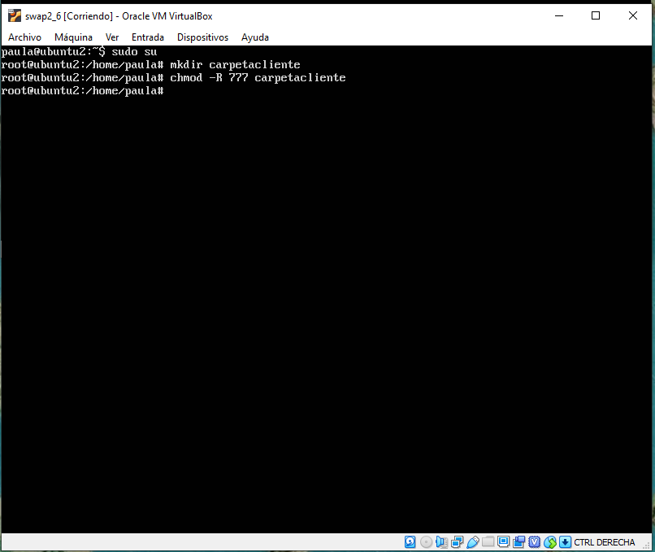
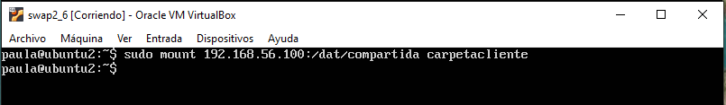
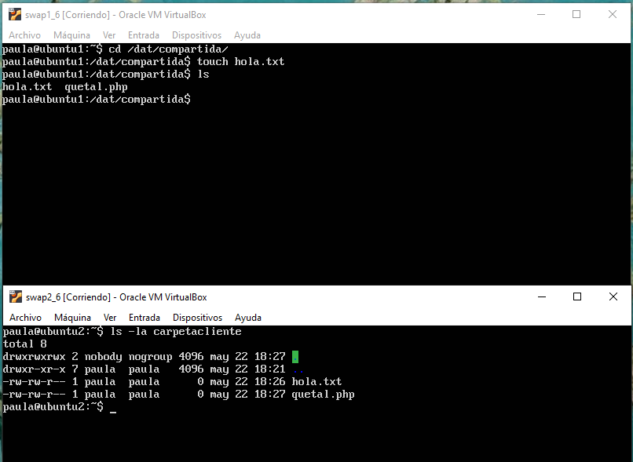
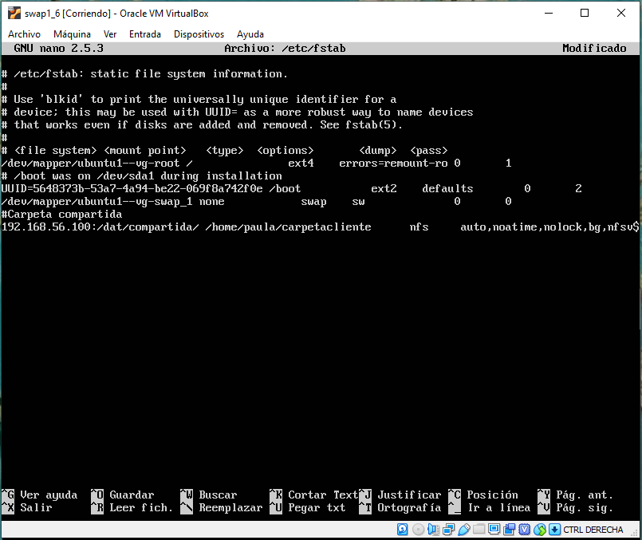
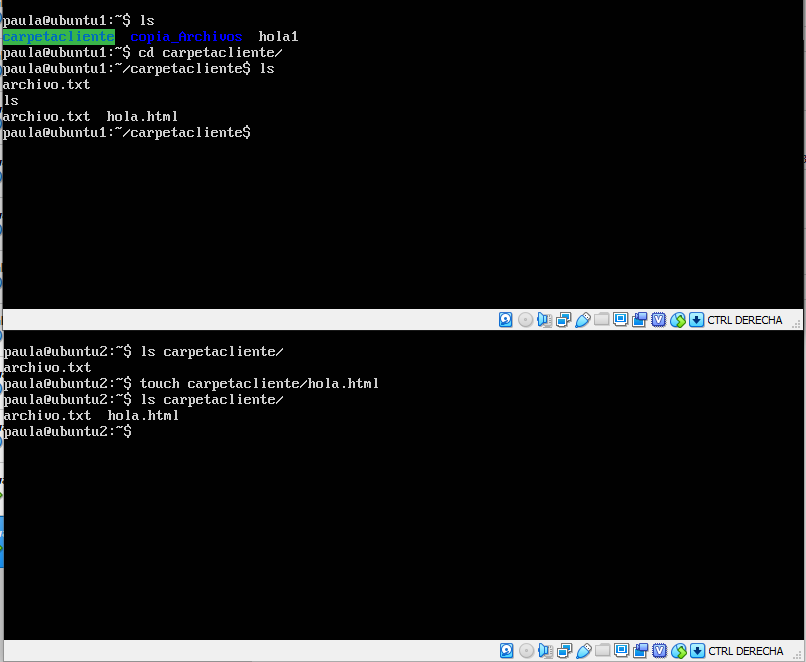

## Practica 6.
### Servidor de disco NFS - por Paula Ruiz.

### Configurar una máquina como servidor de disco NFS y exportar una carpeta a los clientes.
Lo primero que haremos en el servidor 1 es instalar los paquetes necesarios con el siguiente comando:

`sudo apt-get install nfs-kernel-server nfs-common rpcbind`

A continuación, creamos el directorio que compartiremos con los clientes, cambiamos el propietario y añadimos los permisos necesarios.

Ahora debemos editar el archivo de configuración _/etc/exports_ donde debemos añadir las IPs de las máquinas donde queremos exportar la carpeta.

Y finalmente reiniciamos el servicio:

`sudo service nfs-kernel-server restart`

### Montar en las máquinas cliente la carpeta exportada por el servidor.
Una vez configurada la máquina servidora en la máquina 1, configurare las máquinas 1 y 2 como clientes. _Se configuran las cosas paralelamente en ambas máquinas_

A la hora de montar la carpeta exportada, lo primero que debemos hacer es volver a instalar los paquetes necesarios.

`sudo apt-get install nfs-common rpcbind`

Después tenemos que crear la carpeta que será nuestro punto de montaje y darle los permisos necesarios.

Y mediante la siguiente orden traspasamos la carpeta:

`sudo mount 192.168.56.100:/dat/compartida carpetacliente`

### Comprobar que todas las máquinas pueden acceder a los archivos almacenados en la carpeta compartida.

Y vemos que podemos acceder a los mismos archivos desde ambas carpetas.

### Hacer permanente la configuración en los clientes para que monten automáticamente la carpeta compartida al arrancar el sistema.

Finalmente, para poder hacer la configuración permanente y automatizar el proceso debemos añadir una línea de código al archivo de configuración _/etc/fstab_ para que la carpeta compartida se monte al iniciar el sistema.

`192.168.56.100:/dat/compartida /home/paula/carpetacliente/ nfs auto,noatime,nolock,bg,nfsvers=3,intr,tcp,actimeo=1800 0 0`

Reiniciamos el sistema que comprobamos que tenemos los mismos archivos en ambas máquinas.

Y como podemos comprobar todo funciona correctamente.
